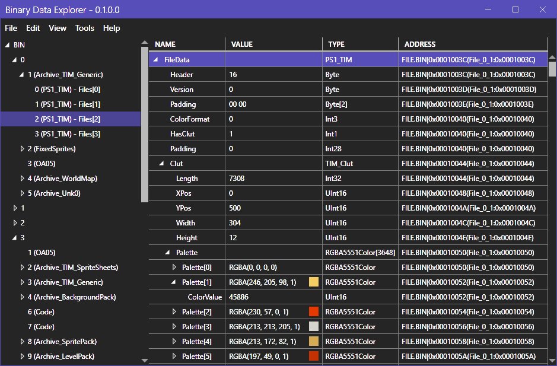

# BinaryDataExplorer
Data explorer tool for [BinarySerializer](https://github.com/RayCarrot/BinarySerializer)

## Supported Formats
* [Rayman 1](https://github.com/RayCarrot/BinarySerializer.Ray1)
    * PC (RAYMAN/KIT)
        * Level
        * Allfix
        * World
        * BigRay
* [Klonoa](https://github.com/RayCarrot/BinarySerializer.Klonoa)
    * Klonoa: Door to Phantomile
        * BIN
    * Klonoa 2: Lunatea's Veil
        * BIN
    * Klonoa Heroes
        * ROM
* [PS1](https://github.com/RayCarrot/BinarySerializer.PS1)
    * Default
        * TIM
        * TMD
        * BGD
        * CEL
* [GameBoy](https://github.com/RayCarrot/BinarySerializer.GBA)
    * Default
        * GBC ROM
        * GBA ROM
* [Image](https://github.com/RayCarrot/BinarySerializer.Image)
    * Default
        * DDS
        * FLIC
        * PCX
        * TGA